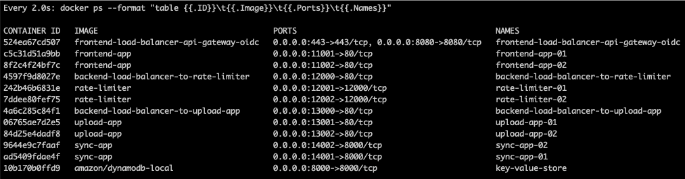
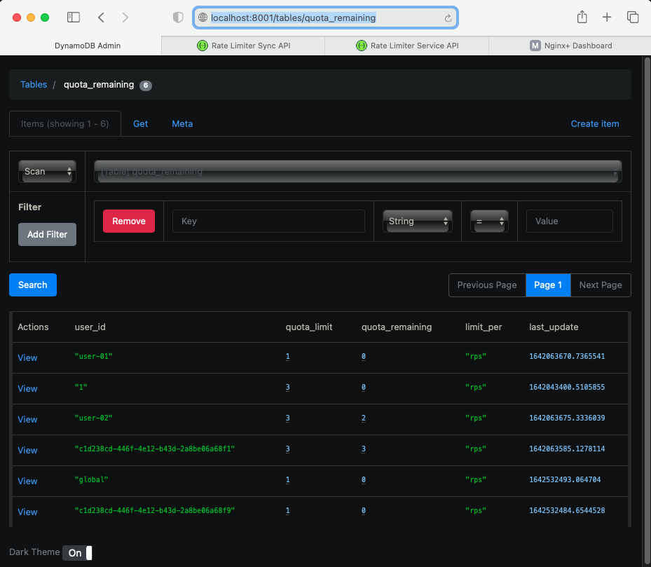

# Distributed Rating Limiting Solution w/ Echo System
The rate-limit allows you to limit the amount of HTTP requests a user can make in a given period of time.

This repo provides **an example of distributed rate-limiter solution** that integrates with load balancers, API gateways, frontend apps, IdP, Rate-Limiters, and fake upload apps. 

> **As-Is**: Load Balancers, API Gateways, Frontend Apps, IdP, Rate-Limiters, and Fake Upload App APIs

> **TBD**: Sync-App between local cache and Distributed Cache/Datastores

```bash
User(SPA)
  |            
  |        [SPA: Frontend]
  |            |                                                        
  |            |                [RL in API-GW or different machine]             Pub
  |   [IdP]--+ |   .................................................    +----> [Sync-App 1..j]
  |          | |   :                                  Sub          :    |       1) Event
  |          | |   :            +- RL 1 --- Cache <-- Sync-App <-+ :    V       2) Regulary
[LB ] --+- [API-GW 1] -+        |     :                          +-+-> [LB] -+ 
 N+     |    N+    :   +- [LB] -+- RL n --- Cache <-- Sync-App <-+ :         +- Cache 1
        |          :   |   NGX                                     :         |        :
        |          :...+...........................................:         +- Cache k
        |              |                                                     |
        |              +- [LB] -+- UA 1 (Fake Upload App)                    +- Datastore 1
        |    N+        |   NGX  |     :                                      |            :
        +- [API-GW m] -+        +- UA i                                      |  Datastore l
             | |                                                             +- (Key/Value)
      [SPA]--+ +-- [IdP]                                                     

* RL: Rate Limiter, UA: Upload-App, LB: Load Balancer
* N+: Nginx Plus, NGX: Nginx OSS
* SPA: Single Page App, GW: Gateway, IdP: Identity Provider (Amazon Cognito)
```

### Table of Contents
- [Getting Started](#getting-started)
- [Directory and File Structure](#directory-and-file-structure)


## Getting Started

**Prerequisites:**
- Install Python 3.x for unit and functional test.
- Install Docker and Docker Compose for integration, end-to-end (E2E) test.
- Install Golang for integration test.
- Add `127.0.0.1 host.docker.internal` into `/etc/hosts` file.
- Add `127.0.0.1 my-rate-limiter.com` into `/etc/hosts` file.
- ]Create your certificates and copy them](https://github.com/shawnhankim/nginx-openid-connect/tree/main/docker#prepare-certs-and-nginx-plus-license) into `services/frontend-load-balancer-api-gateway-oidc/ssl` directory.
- Download the NGINX Plus license files via the [F5/NGINX customer portal](https://cs.nginx.com/?_ga=2.268586425.912746048.1620625839-85838359.1596947109), and copy the files into the following path.
  - Path: `services/frontend-load-balancer-api-gateway-oidc/ssl`
  - Files: `nginx-repo.crt`, `nginx-repo.key`
- [Set up your IdP](https://github.com/shawnhankim/nginx-openid-connect/#configuring-your-idp).


**Create and run Docker container images for `frontend-load-balancer-api-gateway-oidc`, `frontend-app`, `backend-load-balancer-to-rate-limiter`, `rate-limiter`, `backend-load-balancer-to-upload-app`, and `upload-app` :**
```bash
$ make start
``` 

**Check docker status if 9 containers are successfully run:**
```bash
$ make watch
``` 


**Run and Test Distributed Rate-Limiting Solution:**

> Chrome:

  

> Safari:

  


**Run and Check Quota Remaining in Your Key/Value Store:**
You can change `any key/value store` based on your needs. This repo provides a localon DynamoDB as one of key/value stores. You can run the following if you want to check the data by `DynamoDB Admin`.

```bash
npm install -g dynamodb-admin

// For Windows
set DYNAMO_ENDPOINT=http://localhost:8000
dynamodb-admin

// For Mac/Linux
DYNAMO_ENDPOINT=http://localhost:8000 dynamodb-admin
```




## Directory and File Structure

```bash
│
├── Makefile                                      // Command Line Interfaces
│
├── docker                                        // Dockerfiles
│   ├── frontend-load-balancer-api-gateway-oidc
│   ├── frontend-app
│   ├── backend-load-balancer-to-rate-limiter
│   ├── rate-limiter
│   ├── backend-load-balancer-to-upload-app
│   ├── upload-app
│   └── sync-app
│
├── docker-compose.yml
│
└── services
    │
    ├── frontend-load-balancer-api-gateway-oidc // LB, API GW, OIDC, IdP, Rate-Limiter Client
    │   ├── nginx
    │   │   └── conf.d
    │   │       ├── oidc*.*                     // - LB, APIGW, OIDC w/ Frontend, Backend Main
    │   │       ├── rate_limit*.*               // - Rate Limiter Client
    │   │       └── status_api*.*               // - Status API
    │   │   
    │   └── ssl              
    │       ├── my-sample.crt                   // - Use Your Certificates
    │       ├── my-sample.key
    │       ├── nginx-repo.crt                  // - Download Nginx License
    │       └── nginx-repo.key
    │           
    ├── frontend-app                            // Distributed Rate-Limiting Test UI
    │   
    ├── backend-load-balancer-to-rate-limiter   // Frontend -> LB -> Rate Limiters (API)
    │   
    ├── rate-limiter                            // Rate Limiter App
    │   ├── app                                 // - Main
    │   ├── core                                // - Core: API, Common, Algorithm
    │   └── test                                // - Unit/Functional/Integration/E2E Test (In pgoress)
    │       
    ├── backend-load-balancer-to-upload-app     // Frontend -> LB -> Upload Apps (API)
    │
    ├── upload-app                              // Fake Upload App
    │
    ├── sync-app                                // Rate Limiter Sync App between API GWs and Key/Value store
    │   ├── app                                 // - Main (TBD: REST -> Message Bus)
    │   └── core                                // - Core: API, Common, Key/Value Store Lib
    │
    └── dynamodb                                
        └── data                                // Volume to store data rather than memory for testing
```
